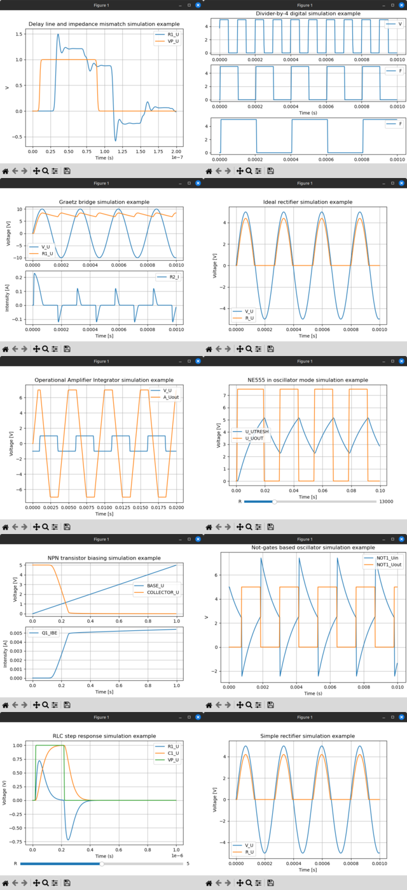
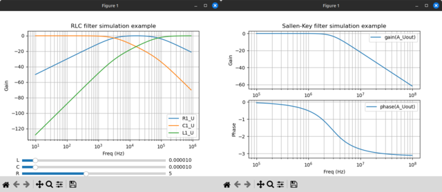

## Introduction ##

**asysc** is an analog system compiler based on the lightweight Computer Algebra System **lightcas**.

With ASysC, you can write your own components by using algebraic descriptions. 

For instance, consider the resistor declaration:

    NAME.CR(@1,@2,R) := { 
        NAME.U=ACROSS(@1,@2); 
        NAME.I=THROUGH(@1,@2); 
        NAME.U=R*NAME.I 
    };

For more examples, see the [component.rule](https://github.com/analog-system-compiler/lightcas/blob/3b8b692d76aa31503276b9a10259393b8f68dcf0/rules/components.rule) and [examples](examples) directories.

The analog system compiler is invoked with the following command (Example with the RLC circuit in AC mode analysis):

```bash
cd examples/ac/RLC
../../../lightcas/bin/asysc -i RLC.cir -o RLC.py -t ac
```

This command generates Python code containing equations for AC simulation.

## Requirements

### C++ requirement
- g++ or clang
- make
  
### Python requirements
  - numpy
  - matplotlib
  
## Getting source code
```bash
git clone https://github.com/analog-system-compiler/asysc.git
cd asysc
git submodule update --init
```

## Code compilation

```bash
make clean
make
```

## Run all tests

```bash
make run
```

## Run a specific test

To execute a particular test, type:

```bash
cd examples
make
cd examples/<directory>
python3 simulation.py
```

## License

This project is licensed under the GNU General Public License - see the [LICENSE](LICENSE) file for details.

## Examples

### Some transient analysis examples



### Some AC analysis examples



